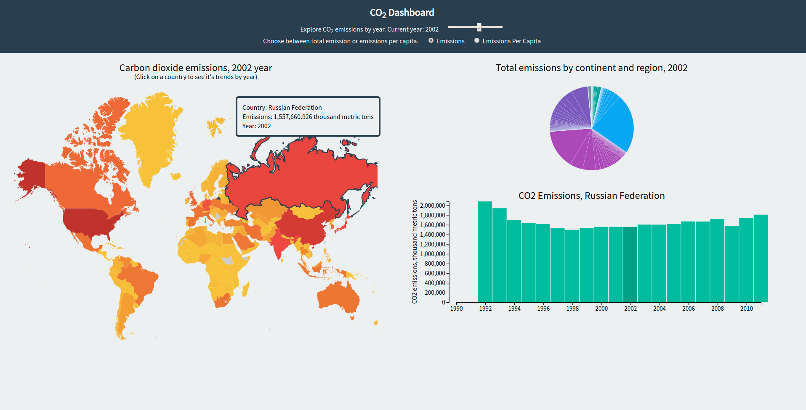

# d3_dashboard
This project uses 'THE WORLD BANK' data set to visualize world's CO2 emissions.

There are three graphs here: 'Map chart', 'Bar chart' and 'Pie Chart'.
All regarding carbon dioxide emissions by country and by year:

>'Map chart' - countries colored by how much CO2 they produced for certain year(the closer to red - the worse pollution).  
'Bar chart' - show annual trend for selected country.  
'Pie Chart' - lets look at emmisions by country as a fraction of total emissions.

User can adjust the year from a header and switch between Emission/Emission Per Capita.

Diagram updates based on the user interaction.

Dashboard include tooltips to highlight important features of the data.

